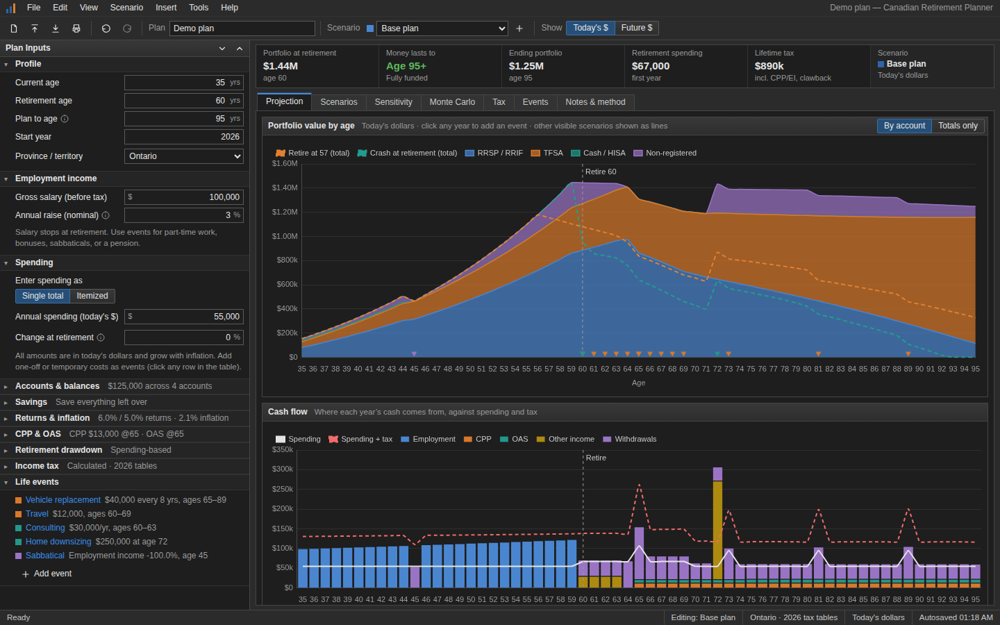
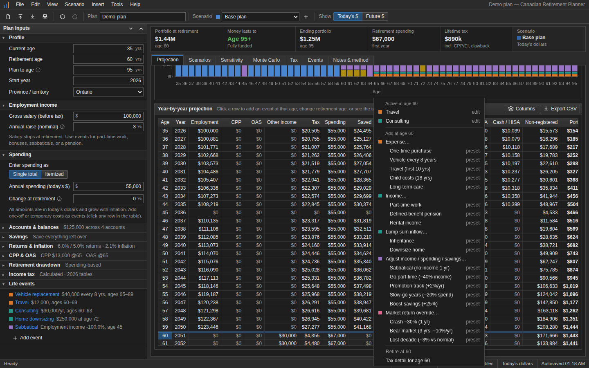
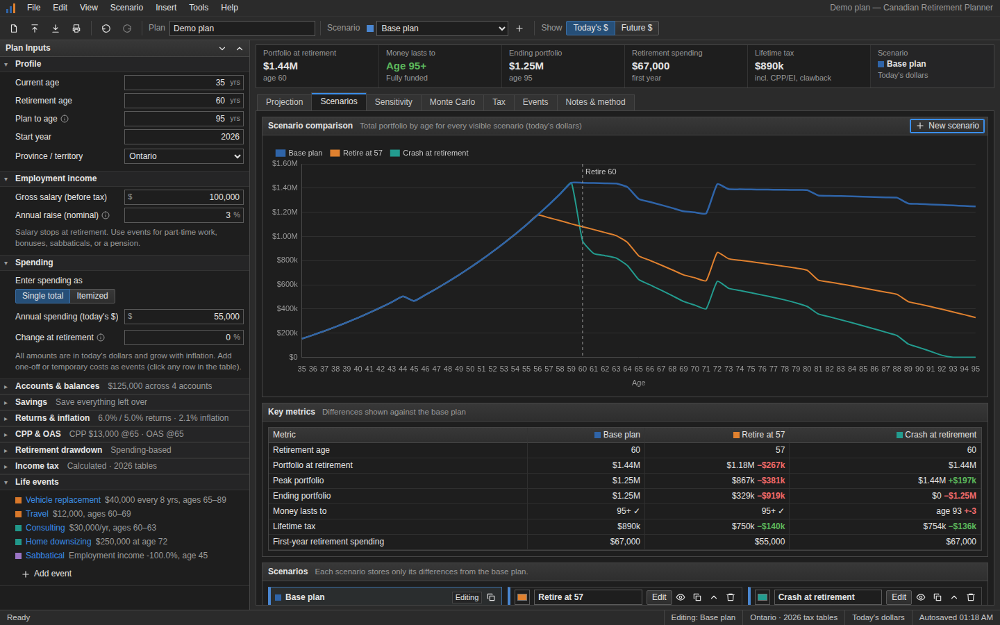
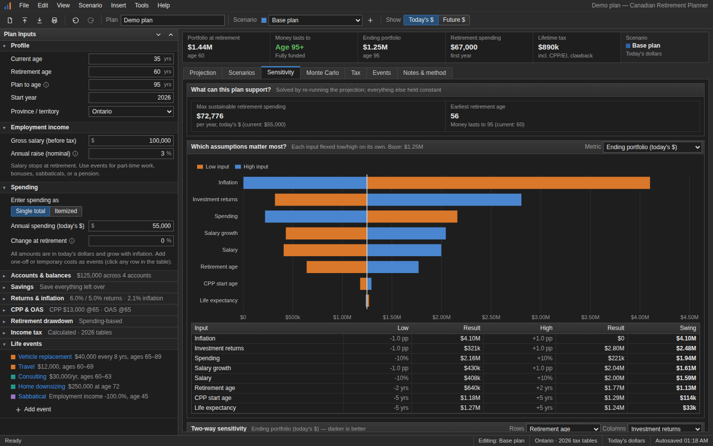
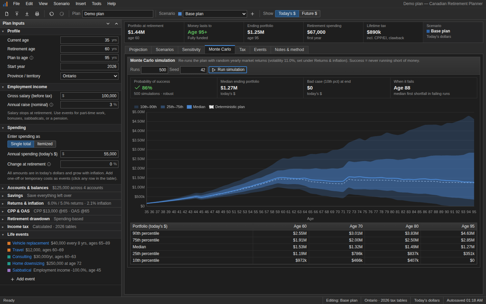
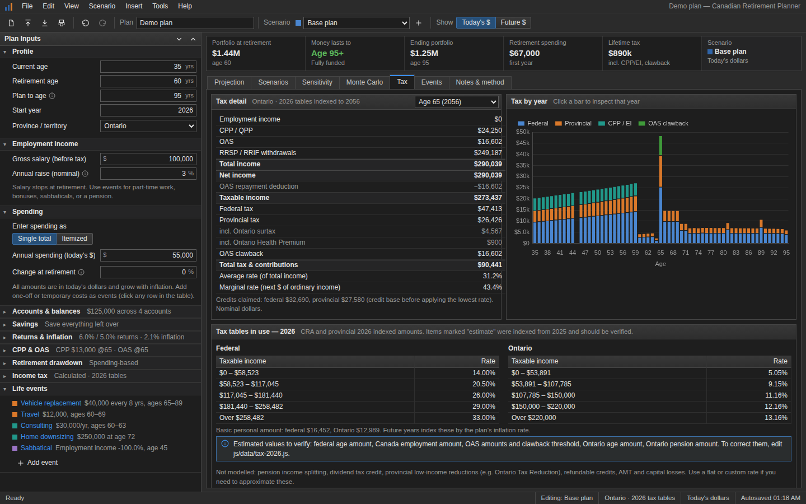
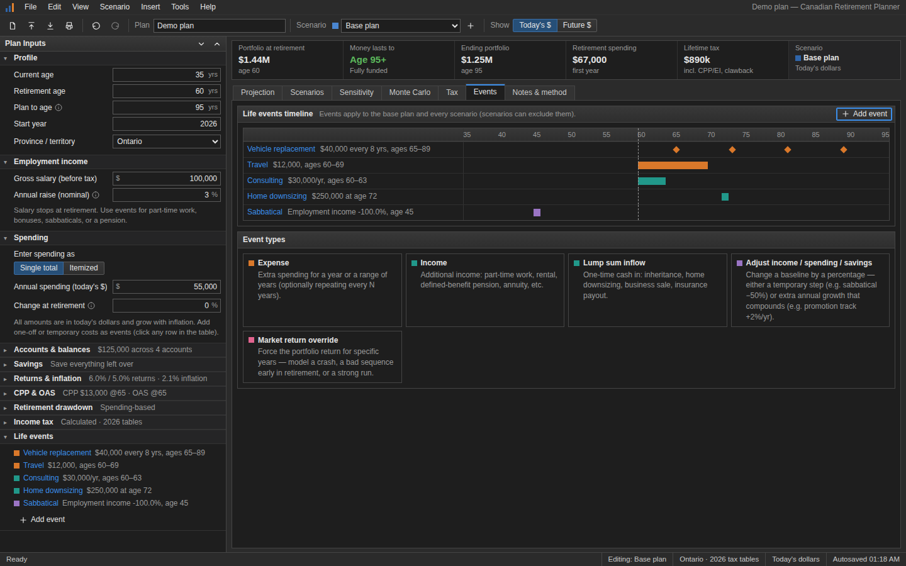

# Canadian Retirement Planner

A private, browser-only retirement planning tool for Canadians. No server, no account, no build step. Open `index.html` and plan.




## Screenshots

Every view comes in a light and a dark theme. The app follows your system setting by default; you can switch under **View › Theme**.

| | Light | Dark |
|---|---|---|
| **Year-by-year table**: click any row to add an event at that age | [](docs/screenshots/light-table-menu.png) | [](docs/screenshots/dark-table-menu.png) |
| **Scenarios**: overlay and compare against the base plan | [](docs/screenshots/light-scenarios.png) | [](docs/screenshots/dark-scenarios.png) |
| **Sensitivity**: solvers, tornado chart, two-way grid | [](docs/screenshots/light-sensitivity.png) | [](docs/screenshots/dark-sensitivity.png) |
| **Monte Carlo**: probability of success and percentile bands | [](docs/screenshots/light-montecarlo.png) | [](docs/screenshots/dark-montecarlo.png) |
| **Tax**: full return-style breakdown for any year | [](docs/screenshots/light-tax.png) | [](docs/screenshots/dark-tax.png) |
| **Events**: timeline of life events across the plan | [](docs/screenshots/light-events.png) | [](docs/screenshots/dark-events.png) |

## Features

- **Tax engine.** Federal plus every province and territory, using 2026 brackets. It handles the basic personal amount (with phase-outs), age, pension and Canada employment amounts, and CPP/QPP, EI and QPIP. It also covers enhanced CPP deductions, the OAS clawback, the Ontario surtax and Health Premium, and the Quebec abatement. Brackets index forward with inflation. You can override with a flat rate or your own brackets.
- **Accounts.** RRSP/RRIF (deductible contributions, taxable withdrawals, RRIF minimums from 72), TFSA, non-registered (cost base tracked, capital gains taxed on withdrawal) and cash/HISA (interest taxed annually). Contribution and withdrawal orders are configurable, with per-account caps and return overrides.
- **Government benefits.** CPP with early/late adjustment and OAS with deferral, residency, the 10% boost at 75, and the clawback.
- **Spending.** One total, or itemised lines tagged "always", "working" or "retired". Includes a percentage change at retirement.
- **Savings.** Save the whole surplus, a percentage of salary, or a fixed amount.
- **Retirement drawdown.** Three strategies:
  - spending-based (grossed up for tax)
  - fixed rate on the starting balance (the 4% rule)
  - a percentage of the current balance
- **Life events.** Click any year in the table or chart to add one:
  - one-off or recurring expenses
  - income (part-time work, DB pension, rental)
  - lump sums
  - % adjustments to income, spending or savings (temporary steps, or extra compounding growth)
  - market-return overrides
- **Scenarios.** Each scenario stores only its differences from the base plan. Changes to the base flow through, and scenarios overlay on the charts with side-by-side metrics.
- **Analysis.** Tornado sensitivity, a two-way sensitivity heatmap, a "max sustainable spending" solver, an "earliest retirement age" solver and Monte Carlo simulation.
- **Output.** Year-by-year table with selectable columns, CSV export, print/PDF, and today's-dollars vs future-dollars views.
- **Saving.** Autosaves in your browser (localStorage). Export/import `.json` plan files, or drag a plan file onto the page. Undo/redo.

## Running it

**Locally:** download or zip this folder and double-click `index.html`. You don't need to run any commands.

**On a website:** upload the folder to any static host (your own site, GitHub Pages, Netlify, S3, etc.).

The only external resource is [Chart.js](https://www.chartjs.org/), loaded from cdnjs. Without an internet connection the calculations, tables and inputs still work and the charts show a notice. To make it fully offline, download `chart.umd.min.js` into the folder and point the `<script>` tag in `index.html` at it.

## Privacy

Everything runs in the browser. Plans are stored in that browser's localStorage and are never transmitted. Use **File → Export** to keep a copy or move it to another computer.

## Project layout

```
index.html                 entry point; loads the scripts below in order
css/app.css                all styles (light + dark tokens at the top)
js/core.js                 RP namespace, registries, utilities, formatting
js/data/tax-2026.js        tax brackets, credits, CPP/EI/OAS parameters, RRIF factors
js/engine/                 pure calculation code, no DOM; also runs in Node
  tax.js                   income tax + payroll + province rules (RP.taxRules)
  events.js                life-event types (RP.eventTypes)
  strategies.js            savings modes + withdrawal strategies
  projection.js            the year-by-year simulation
  scenarios.js             base plan + scenario overrides -> effective plan
  analysis.js              sensitivity, solvers, Monte Carlo (RP.metrics, RP.sensitivityVariables)
js/state/
  schema.js                plan file format, defaults, migrations
  store.js                 app state, undo/redo, autosave, import/export
js/ui/                     interface (plain DOM + Chart.js)
  inputs.js                left panel sections (RP.inputSections)
  panels/*.js              one file per tab (RP.tabs)
tests/run-tests.js         engine tests: `node tests/run-tests.js`
docs/screenshots/          images used in this README (regenerate: node tools/screenshots.js)
```

Files are plain `<script>`s, not ES modules, because browsers block modules on `file://`. Each file attaches what it defines to one global, `RP`.

## Extending it

Nearly everything is a **registry**. Adding a feature usually means registering one more entry; you rarely need to edit the engine.

| To add… | Register in | Where |
|---|---|---|
| A new kind of life event | `RP.eventTypes` | `js/engine/events.js` (its fields auto-generate the edit form) |
| A withdrawal strategy | `RP.withdrawalStrategies` | `js/engine/strategies.js` |
| A savings mode | `RP.savingsModes` | `js/engine/strategies.js` |
| A province-specific tax rule | `RP.taxRules` + `rules: [...]` on the province | `js/engine/tax.js`, `js/data/tax-*.js` |
| A sensitivity variable | `RP.sensitivityVariables` | `js/engine/analysis.js` |
| An output metric | `RP.metrics` | `js/engine/analysis.js` |
| A table column | `RP.tableColumns` | `js/ui/panels/projection.js` |
| A KPI tile | `RP.kpis` | `js/ui/app.js` |
| A scenario template | `RP.scenarioTemplates` | `js/ui/panels/scenarios.js` |
| A section in the input panel | `RP.inputSections` | `js/ui/inputs.js` |
| A whole new tab | `RP.tabs` | new file in `js/ui/panels/` + a `<script>` tag |

**New plan inputs:** add the field with a default in `schema.defaultBase()`. Old saved plans automatically get the default when loaded, because loading deep-merges defaults underneath the file. If you ever need to rename or restructure stored data, bump `SCHEMA_VERSION` and add a step to `schema.migrations`.

**New tax year:** copy `js/data/tax-2026.js` to `tax-2027.js`, update the numbers, and add a `<script>` tag. It then appears in the "Tax table year" picker. Values marked `verify: true` are estimates and are listed in the Tax tab.

## Tests

```
node tests/run-tests.js
```

The tests cover bracket math, CPP/EI maximums, the OAS clawback, the Quebec abatement, every province, the cash-flow identity (income + withdrawals = tax + spending + savings, every year), events, strategies, scenarios and normalisation of old files. Node is only needed for the tests, not for using the app.

## Method & limitations

See the **Notes & method** tab in the app for the full methodology. In brief:
- Single person (no spousal planning or pension splitting yet).
- Contributions are made mid-year and withdrawals at the start of the year.
- Non-registered growth is treated as deferred capital gains at 50% inclusion.
- CPP is indexed from your entered estimate rather than modelled from your earnings history.
- No dividend tax credit, AMT, low-income provincial reductions or contribution-room tracking.

Ideas for later: spouse/household modelling with pension splitting; guardrail withdrawal strategies; RRSP meltdown/CPP-timing optimisers; TFSA/RRSP room tracking; dividend and distribution modelling; shareable plan links.

## Disclaimer

For education and personal planning only. This is not financial, tax or legal advice. Verify tax figures against CRA and provincial sources.
